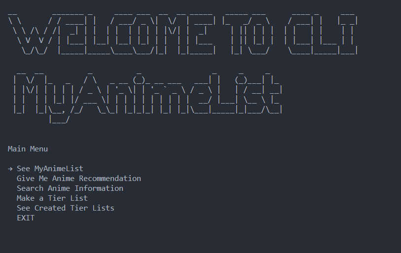

# CLI MyAnimeList
#### Video Demo:  <URL HERE>
#### Description:
CLI MyAnimeList is a program where you can create a list of anime that you want to watch just like in https://myanimelist.net/,
and create a Tier List of anime from S tier to E tier in png image from your list. 
## Main Menu

In this Main Menu, you can see "WELCOME TO CLI MyAnimeList" that i created using pyfiglet.
To install  pyfiglet library in Python, you can use the following command:
```sh
pip install pyfiglet
```
There are 5 menus in this main menu, to select the menu i used pick library for creating interactive selection menus.
To install the pick library in Python, you can use the following command:
```sh
pip install pick
```
## 'See MyAnimeList' and 'Give Me Anime Recommendation' Menu


This program use an API named Jikan. 